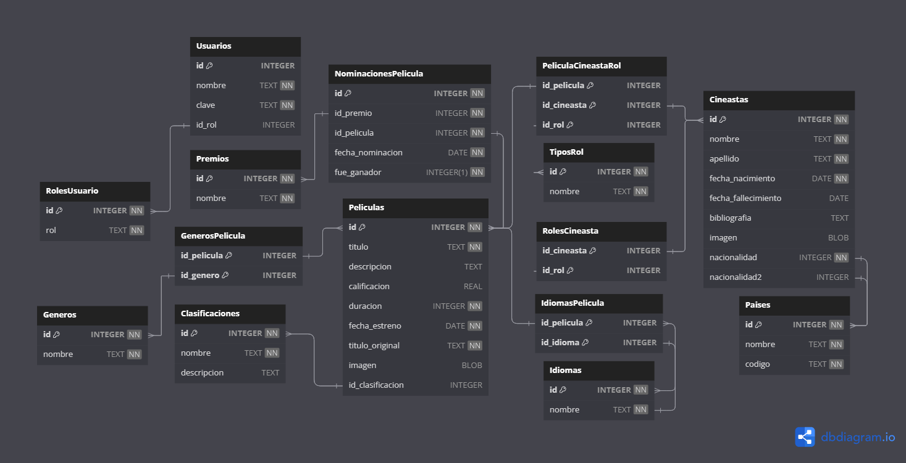

# TPI | Desarrollo de Software | UTN FRC

## Descripción del Proyecto

Este proyecto grupal tiene como objetivo implementar un conjunto de Web APIs o REST APIs utilizando Node.js, Express y Sequelize. Cada integrante del grupo ha creado dos tablas relacionadas, con al menos 10 registros cada una, incluyendo campos numéricos, de fecha y de string. Las APIs implementan los métodos CRUD (Create, Read, Update, Delete) y se han realizado pruebas unitarias para asegurar su correcto funcionamiento.

## Integrantes del Grupo

| Legajo | Apellido y nombre       |
|--------|-------------------------|
|89765   | Gil Matías Ezequiel     |
|89768   | Gutiérrez Agustin Ioime |
|97848   | Witt Facundo            |

## Estructura del Proyecto

```
dds-tpi/
├── backend
|   ├── config
|   |   └── database.js
|   ├── controllers
|   |   ├── generoController.js
|   |   └── ...
|   ├── data
|   |   ├── init.sql
|   |   └── peliculas.db
|   ├── middleware
|   |   ├── errorHandler.js
|   |   └── ...
|   ├── models
|   |   ├── generos.js
|   |   └── ...
|   ├── repositories
|   |   ├── generoRepository.js
|   |   └── ...
|   ├── routes
|   |   ├── genero.routes.js
|   |   └── ...
|   ├── security
|   |   └── auth.js
|   ├── services
|   |   ├── generoService.js
|   |   └── ...
|   ├── test
|   ├── utils
|   |   └── errors.js
|   ├── app.js
|   ├── package-lock.json
|   └── package.json
├── frontend
|   └── ...
├── .gitignore
└── README.md
```
### Descripción
- ```backend/```: Directorio para el código del lado del servidor (backend).
    - ```config/```: Archivos de configuración que contienen parámetros y ajustes necesarios para la operación de la aplicación.  (como las credenciales y la URL de conexión).
    - ```controllers/```: Este directorio contiene los controladores de la aplicación. (responsables de manejar las solicitudes HTTP y responder adecuadamente). Se llaman a funciones del servicio para realizar operaciones de negocios y devolver respuestas a los clientes.
    - ```data/```: Almacenar datos persistentes y archivos relacionados con la base de datos.
        - ```init.sql```: Script SQL que crea tablas y agrega datos iniciales.
        - ```peliculas.db```: Archivo de la base de datos SQLite que almacena los datos de la aplicación.
    - ```middleware/```: Funciones que se ejecutan durante el ciclo de vida de una solicitud HTTP y pueden modificar la solicitud o la respuesta, o terminar el ciclo de vida de la solicitud.
    - ```models/```: Modelos de la aplicación. Representan las estructuras de datos y las operaciones de negocio. Mapean tablas de la base de datos
    - ```repositories/```: Contienen la lógica para acceder y manipular los datos de la base de datos.
    - ```routes/```: Este directorio contiene las definiciones de las rutas de la aplicación. Las rutas definen los endpoints de la API y vinculan las solicitudes HTTP con los controladores correspondientes.
    - ```services/```: Encapsulan la lógica de negocio y las operaciones sobre los datos.
    - ```security/```: Almacenar los archivos y módulos relacionados con la seguridad de la aplicación.
        - ```auth.js```: Archivo que contiene la lógica de autenticación y autorización. Maneja la validación de tokens JWT y asegura que solo los usuarios autenticados puedan acceder a ciertas rutas.
    - ```app.js```: Archivo principal del backend que inicializa la aplicación Express, configura los middlewares, y define las rutas.
    - ```package-lock.json```: Archivo que registra las versiones exactas de las dependencias instaladas. Asegura que las mismas versiones se instalen en todas las máquinas de desarrollo y producción.
    - ```package.json```: Archivo de configuración de npm que contiene la información del proyecto (nombre, versión, etc.), las dependencias del proyecto, y los scripts de npm para ejecutar tareas comunes.
- ```frontend/```: Directorio para el código del lado del cliente (frontend). 

# Backend
Para ejecutar el correctamente el backend, asegurarse de crear un archivo ```.env``` en la raíz del proyecto con las siguientes variables de entorno:
```env
# Variables de entorno para el backend

# Configuración del servidor
PORT=3000

# Base de datos
DB_NAME=data/peliculas.db
DB_DIALECT=sqlite

# JWT
ACCESS_TOKEN_SECRET=accesstokensecret
REFRESH_TOKEN_SECRET=refreshtokensecret

```

## Dependencias
- ```npm i express```
- ```npm i nodemon -D```
- ```npm i cors dotenv```
- ```npm i sqlite3 aa-sqlite sequelize```
- ```npm install jsonwebtoken```
- ```npm install --save-dev jest```
- ```npm install --save-dev supertest```
- ```npm install --save-dev @babel/core @babel/preset-env babel-jest```
- ```npm i bcrypt```
- ```npm i winston```


## DER (Diagrama Entidad-Relación)
La base de datos almacena información relacionada con películas, cineastas, clasificaciones, roles de cineasta, idiomas, géneros, países y tipos de traducción.



### Tablas:
- ```Paises```: Almacena información sobre países, incluyendo su nombre y código.
- ```Generos```: Contiene los géneros de películas disponibles.
- ```TiposTraduccion```: Guarda los tipos de traducción que se pueden aplicar a las películas.
- ```Idiomas```: Almacena los idiomas disponibles.
- ```Clasificaciones```: Contiene las clasificaciones de las películas.
- ```TiposRol```: Guarda los roles que pueden tener los cineastas en las películas.
- ```Cineastas```: Contiene información sobre los cineastas, incluyendo su nombre, apellido, fecha de nacimiento y nacionalidad.
- ```Peliculas```: Almacena detalles de las películas, como título, descripción, calificación, duración, fecha de estreno, título original y clasificación.
- ```RolesCineasta```: Asocia los cineastas con sus roles en las películas.
- ```PeliculaCineastaRol```: Relaciona las películas con los cineastas y sus roles específicos en esas películas.
- ```IdiomasPelicula```: Asocia las películas con los idiomas en los que están disponibles y el tipo de traducción aplicado.
- ```GenerosPelicula```: Establece la relación entre las películas y sus géneros correspondientes.
- ```Usuarios```: Almacena información sobre los usuarios de la aplicación, incluyendo su nombre, clave (aplicando un hash con la librería ```bcrypt```), y rol asociado.
- ```Premio```: Contiene información sobre los premios que se pueden otorgar a las películas. (Mejor película, mejor actor, mejor director, etc.)
- ```Academias```: Almacena información sobre las academias que otorgan premios a las películas.
- ```NominacionesPelicula```: Relaciona las películas con las nominaciones que han recibido en las academias.
- ```NominacionesCineasta```: Asocia los cineastas con las nominaciones que han recibido en las academias.

Script que crea las tablas e inserta valores: [init.sql](backend\data\init.sql)